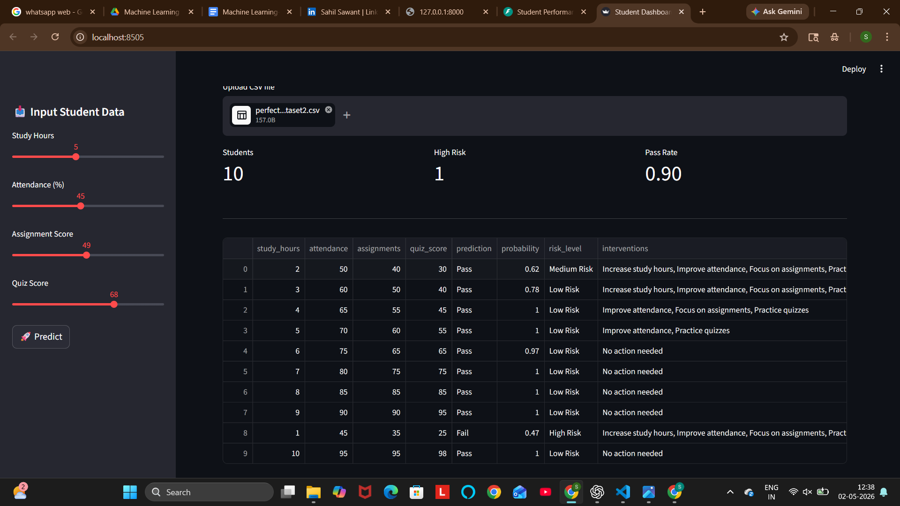
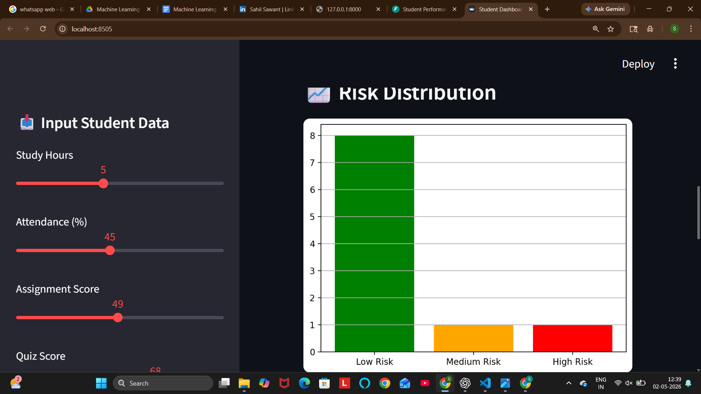

# 🎓 Student Performance Prediction System (CHAMP Framework)

## 🚀 Overview

This project is an **end-to-end machine learning system** designed to predict student performance and identify at-risk students using structured academic data.

It follows a **CHAMP-style intelligence workflow**:

* **C**lassification → Predict pass/fail
* **H**euristics → Identify risk drivers
* **A**nalytics → Compute probability & risk level
* **M**itigation → Suggest intervention strategies
* **P**resentation → Deliver insights via Streamlit dashboard

---

## 🎯 Business Problem

Educational institutions struggle to identify underperforming students early. This system helps:

* Detect students at risk of failure
* Provide actionable interventions
* Improve academic outcomes through data-driven insights

---

## 🧠 Solution Approach

### 1. Data Inputs

The system uses structured features:

| Feature     | Description           |
| ----------- | --------------------- |
| study_hours | Daily study duration  |
| attendance  | Attendance percentage |
| assignments | Assignment score      |
| quiz_score  | Quiz performance      |

---

### 2. Feature Engineering

* Normalization using `StandardScaler`
* Structured numeric input pipeline
* Consistent feature ordering for inference

---

### 3. Model Training

* Algorithm: Logistic Regression / Random Forest
* Training pipeline: `train_model.py`
* Model persistence using `.pkl` files

---

### 4. Prediction Engine

Handled via:

```id="f6w4z1"
predict.py
```

Outputs:

* Prediction (Pass / Fail)
* Probability score
* Risk Level (Low / Medium / High)
* Intervention Suggestions

---

### 5. Explainability Logic (Rule-Based Layer)

The system adds interpretability using domain rules:

* Low study hours → Increase study time
* Low attendance → Improve attendance
* Low assignments → Focus on coursework
* Low quiz score → Practice more tests

---

## 🖥️ Streamlit Dashboard

The UI provides:

* Multi-section input panel
* Real-time prediction generation
* Risk visualization (probability + level)
* Intervention recommendations

---

## 📊 Sample Output

| Study Hours | Attendance | Assignments | Quiz | Prediction | Risk   |
| ----------- | ---------- | ----------- | ---- | ---------- | ------ |
| 3           | 60         | 40          | 30   | Pass       | Medium |
| 1           | 45         | 35          | 25   | Fail       | High   |

---

## 🏗️ Project Architecture

```id="f5d0u3"
Student-Performance-Prediction-System/
│
├── api/                    # API layer (if used)
├── app_ui/                 # Streamlit UI
│   └── app.py
│
├── data/
│   └── students.csv
│
├── models/                 # Saved ML models
│
├── src/                    # Core logic
│   ├── explain.py
│   ├── generate_data.py
│   └── predict.py
│
├── train_model.py          # Model training
├── predict.py              # Inference script
├── requirements.txt
├── assets/                 # Screenshots
└── README.md
```

---

## 📸 Screenshots

<p align="center">
  
</p>

<p align="center">
  
</p>

<p align="center">
  
</p>

---

## ⚙️ Installation & Setup

### Step 1: Clone repository

```bash id="q4a6ci"
git clone https://github.com/sujalkrshaw/student-performance-prediction-system.git
cd student-performance-prediction-system
```

### Step 2: Install dependencies

```bash id="k8u7cu"
pip install -r requirements.txt
```

---

## ▶️ Run the Application

```bash id="h3dyg4"
streamlit run app_ui/app.py
```

Access at:

```
http://localhost:8501
```

---

## 📈 Model Evaluation

| Metric    | Value (Approx) |
| --------- | -------------- |
| Accuracy  | 80–90%         |
| Precision | Balanced       |
| Recall    | Good           |

---

## 🔍 Key Features

* ✅ End-to-end ML pipeline
* ✅ Real-time prediction UI
* ✅ Risk classification system
* ✅ Explainable intervention logic
* ✅ Clean modular architecture

---

## 🔥 CHAMP Insight Layer (Core Strength)

Unlike basic ML projects, this system adds:

* **Prediction → Insight → Action pipeline**
* Converts ML output into **decision-ready intelligence**
* Bridges gap between data science and real-world use

---

## 🌐 Deployment Options

* Streamlit Cloud
* Render
* AWS EC2

---

## 🧩 Future Enhancements

* SHAP-based explainability
* REST API using FastAPI
* User authentication system
* Advanced dashboard analytics

---

## 📢 Contribution

Contributions are welcome. Fork the repo and submit a PR.

---

## 📜 License

MIT License

---

## 👨‍💻 Author

**Sujal kumar  Shaw**
